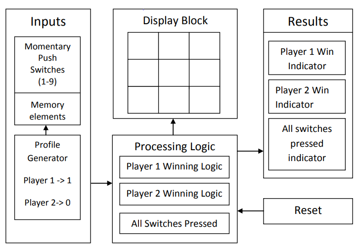

# Tic Tac Toe

## Introduction
The ***`Tic Tac Toe`*** project involves designing a classic `Tic Tac Toe` game using only logic ICs. This project demonstrates the application of digital logic design principles to create a functional game system.

### Project Requirements
1. ***`Dual Color LEDs`***: `Red LEDs` represent `Player 1`, and `Green LEDs` represent `Player 2`.
2. ***`Momentary Micro Switches`***: Used for input, making it easy to reset the game at any point without the overhead of pole switches or push buttons.
3. ***`Move Validation`***: Ensures that players cannot override each other's moves. For example, if `Player 1` selects a cell, `Player 2` cannot select the same cell.
4. ***`Game Reset`***: Players have the ability to reset the game at any point.
5. ***`Result Lock`***: Once a player wins, the result state is locked. Even if the other player meets the winning criteria later, the game will only show the initial winner.
6. ***`Draw Indicator`***: If all switches are pressed or a draw situation occurs, a separate LED will glow.

## Block Diagram
Below is the block diagram for the `Tic Tac Toe` project:

### Detailed Explanation
A detailed explanation of the block diagram, including the circuit diagram and an in-depth look at all the blocks, is provided in a PDF document. You can view and download the PDF for a comprehensive understanding of the design and functionality.

[Download Detailed Explanation PDF](Tic-Tac-Toe.pdf)

## Code
The code for this project is implemented using logic ICs and does not involve a microcontroller or programming language. The design is based entirely on digital logic circuits.

### Schematic and Design Files
- ***`Circuit Diagram`***: Includes detailed schematics of the logic ICs used in the game design.
- ***`Logic IC Configuration`***: Documentation of the specific logic ICs and their configurations.

